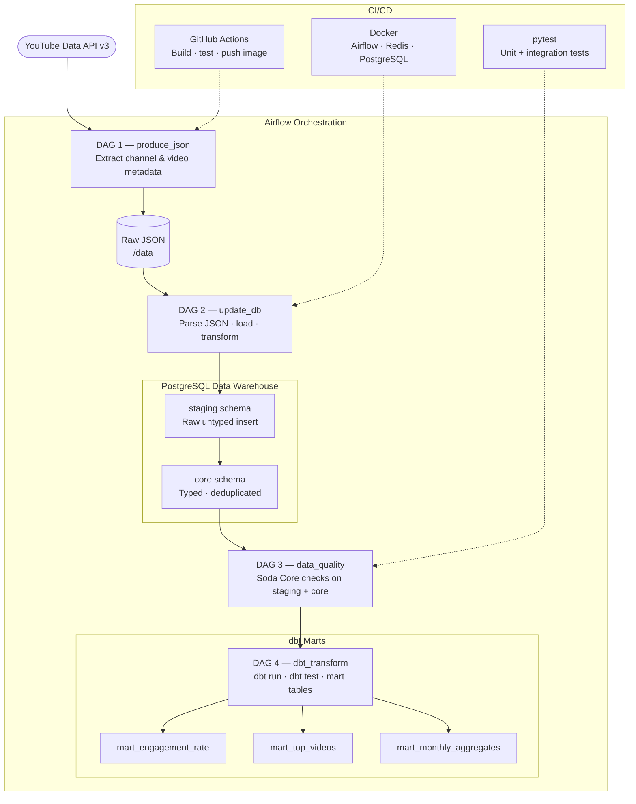
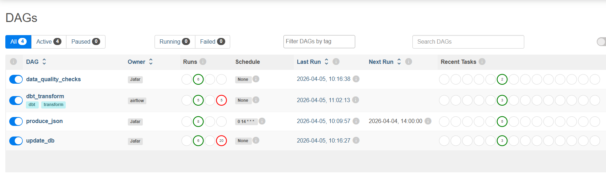
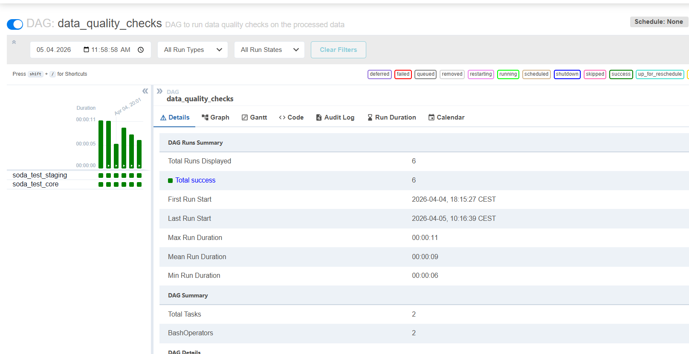
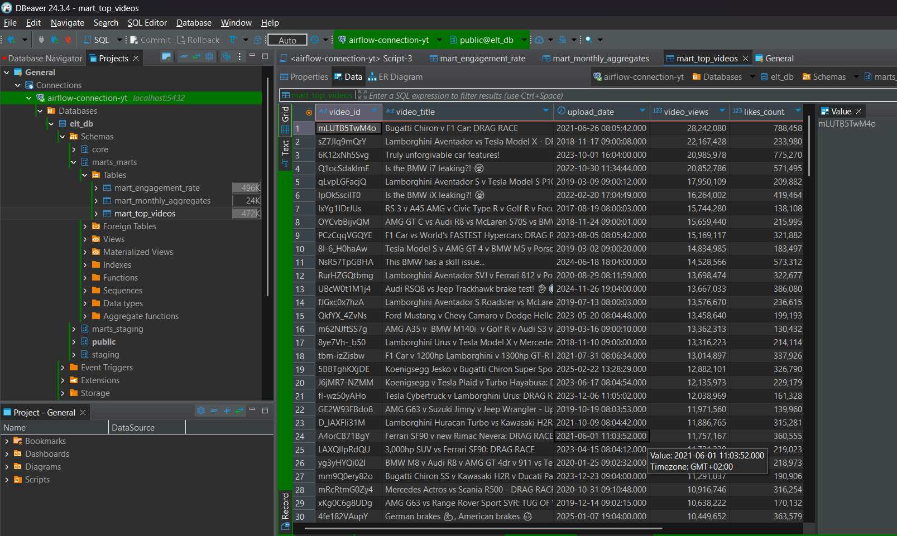
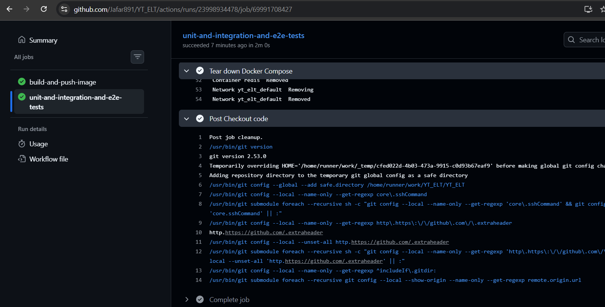

# YT_ELT — YouTube Data Pipeline

## Contact

**Jafar Gahramanov** — [LinkedIn](https://www.linkedin.com/in/jafar-gahramanov/) · [GitHub](https://github.com/Jafar891)

A production-style ELT pipeline that extracts data from the **YouTube Data API v3**, loads it into a **PostgreSQL** data warehouse (staging → core schema), runs automated data quality checks, and transforms data into analytics-ready mart tables via **dbt** — all orchestrated by **Apache Airflow**, containerised with **Docker**, tested with **pytest + Soda Core**, and deployed via **GitHub Actions CI/CD**.

[](https://github.com/Jafar891/YT_ELT/actions/workflows/ci-cd_yt-elt.yaml)
[](https://www.docker.com/)
[](https://airflow.apache.org/)
[](https://www.getdbt.com/)
[](https://www.postgresql.org/)
[](https://www.soda.io/)
[](https://www.python.org/)


---

## Table of Contents

- [Overview](#overview)
- [Architecture](#architecture)
- [Tech Stack](#tech-stack)
- [Project Structure](#project-structure)
- [Pipeline DAGs](#pipeline-dags)
- [Data Model](#data-model)
- [dbt Transformation Layer](#dbt-transformation-layer)
- [Getting Started](#getting-started)
- [Environment Variables](#environment-variables)
- [Running the Pipeline](#running-the-pipeline)
- [Testing](#testing)
- [CI/CD](#cicd)
- [Design Decisions](#design-decisions)

---

## Overview

This project ingests metadata for a YouTube channel (videos, view counts, likes, comments, etc.) using the YouTube Data API v3, and builds a small data warehouse locally. The pipeline follows a two-layer ELT pattern:

1. **Extract** — Python scripts hit the YouTube API and write raw JSON to disk
2. **Load** — raw data is inserted into a `staging` schema in PostgreSQL with minimal transformation
3. **Transform** — data is promoted to a `core` schema with cleaning, typing, and deduplication
4. **Quality checks** — Soda Core validates row counts, nulls, and freshness on both layers
5. **dbt models** — mart tables are built on top of the core schema for analytics

The pipeline runs on a schedule via Airflow's CeleryExecutor, with Redis as the message broker and PostgreSQL as the metadata store.

---

## Architecture



All services run in Docker containers managed by `docker-compose`:

| Container | Role |
|---|---|
| `postgres` | Data warehouse + Airflow metadata DB + Celery result backend (3 logical databases) |
| `redis` | Celery message broker |
| `airflow-webserver` | Airflow UI at `localhost:8080` |
| `airflow-scheduler` | Reads DAG files, schedules tasks |
| `airflow-worker` | Executes tasks via CeleryExecutor |
| `airflow-init` | One-shot init: DB migrations + admin user creation |

## Pipeline in Action

Here are real screenshots of the end-to-end pipeline running successfully:

### Airflow Orchestration


### Data Quality & Transformation


### Final Output
  




---

## Tech Stack

| Tool | Version | Purpose |
|---|---|---|
| Apache Airflow | 2.9.2 | Orchestration |
| PostgreSQL | 13 | Data warehouse + Airflow metadata |
| Redis | 7.2 | Celery message broker |
| dbt Core | 1.7.0 | Transformation layer + mart models |
| Docker / Compose | — | Containerisation |
| Python | 3.x | Extraction scripts, DAG code |
| Soda Core | — | Data quality checks |
| pytest | — | Unit + integration testing |
| GitHub Actions | — | CI/CD |

---

## Project Structure

```
YT_ELT/
├── .github/
│   └── workflows/              # GitHub Actions CI/CD pipelines
├── dags/                       # Airflow DAG definitions
│   ├── produce_json.py         # DAG 1: extract API data → JSON
│   ├── update_db.py            # DAG 2: load JSON → staging → core
│   ├── data_quality.py         # DAG 3: Soda Core quality checks
│   └── dbt_transform.py        # DAG 4: dbt run + test
├── dbt/
│   └── yt_elt/                 # dbt project
│       ├── dbt_project.yml
│       ├── profiles.yml
│       └── models/
│           ├── staging/        # stg_videos (view)
│           └── marts/          # mart tables
├── data/                       # Raw JSON output from extraction
├── docker/
│   └── postgres/
│       └── init-multiple-databases.sh
├── include/
│   └── soda/                   # Soda Core check YAML files
├── tests/                      # pytest unit + integration tests
├── docker-compose.yaml
├── dockerfile
└── requirements.txt
```

---

## Pipeline DAGs

### DAG 1: `produce_json`

Hits the YouTube Data API v3 using the channel handle stored in the `CHANNEL_HANDLE` Airflow variable and the API key stored in `API_KEY`. Writes raw video metadata to JSON files in the `/data` directory.

**Trigger:** Manual or scheduled
**Output:** Raw JSON file in `/data`

### DAG 2: `update_db`

Triggered after `produce_json` completes. Reads the JSON file, inserts raw records into the `staging` schema, then promotes cleaned and typed data into the `core` schema.

**Staging → Core transformations include:**
- Type casting (strings → integers, timestamps)
- Deduplication on video ID
- Null handling for missing fields (e.g. videos with comments disabled)

**Output:** Populated `core` tables in PostgreSQL

### DAG 3: `data_quality`

Runs Soda Core checks defined in `include/soda/` against both the staging and core schemas. Checks include:

- Row count thresholds
- Null checks on required columns (video ID, title, published date)
- Freshness checks to confirm the pipeline ran recently

**Output:** Pass/fail report per check; DAG fails if any critical check fails

### DAG 4: `dbt_transform`

Triggered manually after `update_db` completes. Runs the full dbt project — installs dependencies, builds all models, and runs schema tests.

**Tasks:** `dbt_deps` → `dbt_run` → `dbt_test`
**Output:** Three mart tables in the `marts` schema in PostgreSQL

---

## Data Model

### Staging Schema (`staging`)

Raw insert, typed as text/varchar to accept whatever the API returns without errors.

| Column | Type | Notes |
|---|---|---|
| `Video_ID` | VARCHAR | YouTube video ID |
| `Video_Title` | TEXT | Video title |
| `Upload_Date` | VARCHAR | Raw timestamp |
| `Duration` | VARCHAR | Video duration |
| `Video_Type` | VARCHAR | Type classification |
| `Video_Views` | VARCHAR | Raw string from API |
| `Likes_Count` | VARCHAR | May be null (hidden likes) |
| `Comments_Count` | VARCHAR | May be null (comments disabled) |

### Core Schema (`core`)

Typed, deduplicated, analytics-ready.

| Column | Type | Notes |
|---|---|---|
| `Video_ID` | VARCHAR | Primary key |
| `Video_Title` | TEXT | |
| `Upload_Date` | TIMESTAMP | Cast from raw string |
| `Duration` | VARCHAR | |
| `Video_Type` | VARCHAR | |
| `Video_Views` | BIGINT | Cast, nulls replaced with 0 |
| `Likes_Count` | BIGINT | Nullable |
| `Comments_Count` | BIGINT | Nullable |

---

## dbt Transformation Layer

After the core schema is populated by `update_db`, a dbt project transforms the data into analytics-ready **mart tables** in a dedicated `marts` schema.

### Models

| Model | Type | Description |
|---|---|---|
| `stg_videos` | View | Cleans and renames columns from `core.yt_api` |
| `mart_engagement_rate` | Table | Engagement rate and like rate per video |
| `mart_top_videos` | Table | All videos ranked by view count |
| `mart_monthly_aggregates` | Table | Monthly rollup of views, likes, comments |

### dbt Project Structure

```
dbt/yt_elt/
├── dbt_project.yml
├── profiles.yml
└── models/
    ├── staging/
    │   ├── sources.yml             # Defines core.yt_api as a source
    │   └── stg_videos.sql          # Cleans and renames columns
    └── marts/
        ├── schema.yml              # Column tests for all mart models
        ├── mart_engagement_rate.sql
        ├── mart_top_videos.sql
        └── mart_monthly_aggregates.sql
```

### Querying the Marts

```sql
-- Top videos by engagement rate
SELECT * FROM marts.mart_engagement_rate LIMIT 10;

-- Top videos by view count
SELECT * FROM marts.mart_top_videos LIMIT 10;

-- Monthly publishing trends
SELECT * FROM marts.mart_monthly_aggregates;
```

### Design Note

dbt runs inside the same Airflow Docker container — no separate service needed. The `profiles.yml` reads database credentials from environment variables, consistent with the rest of the project's secrets management approach.

---

## Getting Started

### Prerequisites

- Docker Desktop (≥4GB RAM allocated, ≥2 CPUs)
- Docker Compose v2
- A [YouTube Data API v3 key](https://developers.google.com/youtube/v3/getting-started)
- A YouTube channel handle (e.g. `@carwow`)

### 1. Clone the repository

```bash
git clone https://github.com/Jafar891/YT_ELT.git
cd YT_ELT
```

### 2. Create a `.env` file

Copy `.env.example` and fill in your values:

```bash
cp .env.example .env
```

### 3. Build the custom Airflow image

```bash
docker build -t your_dockerhub_username/yt_elt:latest .
```

### 4. Initialise and start the stack

```bash
docker compose up airflow-init
docker compose up -d
```

Wait ~60 seconds for all health checks to pass.

### 5. Access the Airflow UI

Navigate to [http://localhost:8080](http://localhost:8080) and log in with the username/password set in `.env` (default: `airflow` / `airflow`).

---

## Environment Variables

All secrets and configuration are passed via environment variables — never hardcoded. In local development these are read from `.env`. In GitHub Actions they are stored as repository secrets and injected at runtime.

| Variable | How it's set | Used in |
|---|---|---|
| `AIRFLOW_VAR_API_KEY` | `.env` / GitHub Secret | YouTube API extraction |
| `AIRFLOW_VAR_CHANNEL_HANDLE` | `.env` / GitHub Secret | YouTube API extraction |
| `ELT_DATABASE_NAME` | `.env` / GitHub Secret | PostgreSQL + dbt |
| `ELT_DATABASE_USERNAME` | `.env` / GitHub Secret | PostgreSQL + dbt |
| `ELT_DATABASE_PASSWORD` | `.env` / GitHub Secret | PostgreSQL + dbt |

Note: Airflow variables set via environment variables (prefixed `AIRFLOW_VAR_`) are accessible via `Variable.get()` in DAG code but will not appear in the Airflow UI Variables tab — this is expected behaviour per [Airflow docs](https://airflow.apache.org/docs/apache-airflow/stable/howto/variable.html#storing-variables-in-environment-variables).

---

## Running the Pipeline

In the Airflow UI at `localhost:8080`, trigger DAGs in order:

1. Unpause and trigger `produce_json` → wait for green
2. Unpause and trigger `update_db` → wait for green
3. Unpause and trigger `data_quality` → wait for green
4. Unpause and trigger `dbt_transform` → wait for green

To inspect the data directly:

```bash
docker exec -it postgres psql -U yt_elt_user -d yt_elt
```

```sql
-- Core table
SELECT * FROM core.yt_api LIMIT 10;

-- dbt mart tables
SELECT * FROM marts.mart_engagement_rate LIMIT 10;
SELECT * FROM marts.mart_top_videos LIMIT 10;
SELECT * FROM marts.mart_monthly_aggregates;
```

Or use a GUI tool like [DBeaver](https://dbeaver.io/) with host `localhost`, port `5432`.

---

## Testing

### Unit tests (pytest)

Tests DAG structure, task counts, environment variable injection, and mock connections.

```bash
docker exec -it airflow-worker pytest tests/ -v
```

### Integration tests

Tests real PostgreSQL connectivity and YouTube API availability in CI using the live environment.

### Data quality tests (Soda Core)

YAML-based checks in `include/soda/` run as part of the `data_quality` DAG — row counts, null checks, and freshness validation on both staging and core schemas.

### dbt tests

Schema tests defined in `dbt/yt_elt/models/marts/schema.yml` run automatically as part of the `dbt_transform` DAG — uniqueness and not-null checks on all mart models.

---

## CI/CD

A GitHub Actions workflow runs on every push to `main`:

1. **Build** the custom Docker image (only when `dockerfile` or `requirements.txt` changes)
2. **Run unit and integration tests** with pytest inside the container
3. **Run DAG import tests** to verify all 4 DAGs parse without errors
4. **Push** the validated image to Docker Hub

To use CI/CD, add the following to your GitHub repository secrets and variables (`Settings → Secrets → Actions`):

```
API_KEY, CHANNEL_HANDLE, FERNET_KEY
POSTGRES_CONN_USERNAME, POSTGRES_CONN_PASSWORD, POSTGRES_CONN_HOST, POSTGRES_CONN_PORT
METADATA_DATABASE_NAME, METADATA_DATABASE_USERNAME, METADATA_DATABASE_PASSWORD
ELT_DATABASE_NAME, ELT_DATABASE_USERNAME, ELT_DATABASE_PASSWORD
CELERY_BACKEND_NAME, CELERY_BACKEND_USERNAME, CELERY_BACKEND_PASSWORD
AIRFLOW_WWW_USER_USERNAME, AIRFLOW_WWW_USER_PASSWORD
DOCKERHUB_NAMESPACE, DOCKERHUB_REPOSITORY, DOCKERHUB_USERNAME, DOCKERHUB_PASSWORD
AIRFLOW_UID
```

---

## Design Decisions

**Why CeleryExecutor instead of LocalExecutor?**
CeleryExecutor with Redis was chosen to mirror a more realistic production setup where tasks run on distributed workers. For a single-machine local project LocalExecutor would suffice, but this setup makes it easier to scale horizontally by adding more `airflow-worker` containers.

**Why three separate PostgreSQL databases?**
Airflow metadata, the Celery result backend, and the ELT data warehouse are kept in separate logical databases (all on the same Postgres instance) to avoid coupling. The `init-multiple-databases.sh` script bootstraps all three on first container startup.

**Why a two-layer staging/core schema?**
Loading raw data into staging first means the API data is preserved exactly as received. If a transformation logic bug is found later, the raw data can be reprocessed without re-hitting the API. It also makes the transformation step independently testable.

**Why Soda Core over dbt tests for data quality?**
Soda Core integrates directly with Airflow as a task and supports SQL-based checks without requiring a dbt project. It makes data quality a visible, first-class step in the DAG graph rather than a side effect of the transformation layer.

**Why dbt for the mart layer?**
dbt brings software engineering practices to SQL — version control, modular models, schema tests, and a clear lineage graph. Adding it on top of the core schema separates transformation concerns cleanly and mirrors how modern data teams operate.

**Adapting this for a different channel**
Change `CHANNEL_HANDLE` in `.env` to any YouTube channel handle. No other changes are required — the extraction script resolves the channel ID from the handle dynamically.
